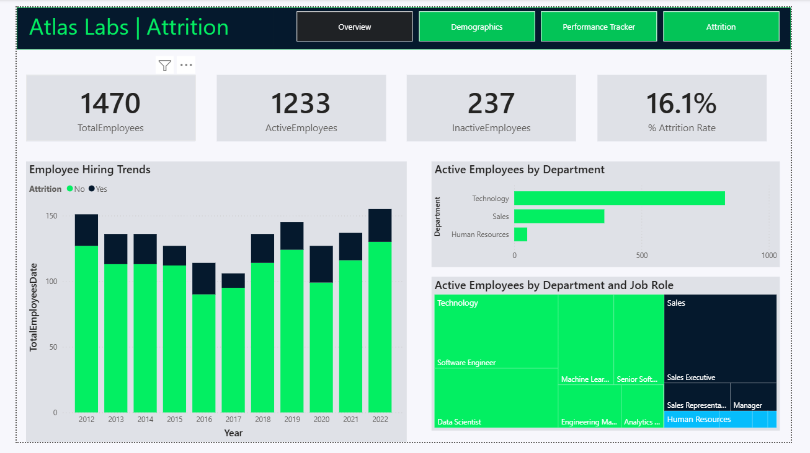
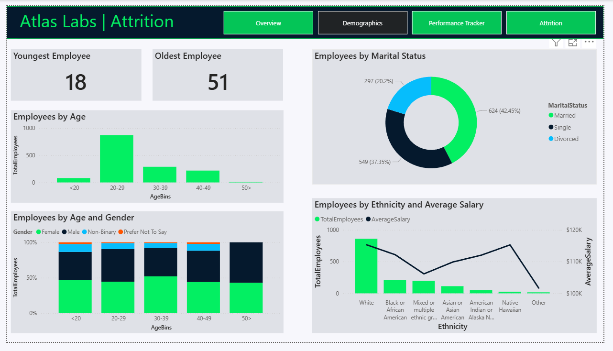
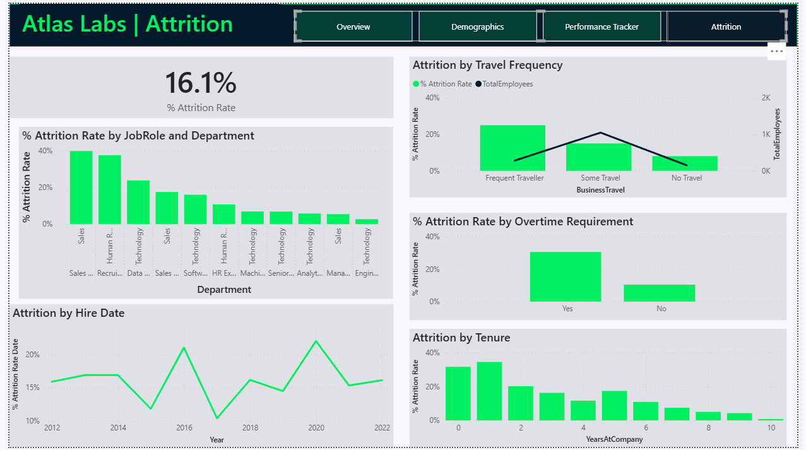

# 📊 HR Analytics Dashboard (Power BI)

An end-to-end HR Analytics project built using Power BI to analyze employee demographics, performance, and attrition.
This dashboard provides actionable insights to support data-driven HR decision-making.

---

## 📌 Project Overview

Understanding employee behavior, performance, and retention is critical for organizational success.

This project analyzes HR data to uncover patterns in workforce composition, employee satisfaction, and attrition.
The dashboard is designed to help stakeholders identify key issues and take proactive actions.

---

## 🎯 Objectives

* Analyze workforce demographics and diversity
* Track employee performance and satisfaction
* Identify key drivers of employee attrition
* Provide actionable insights for HR decision-making

---

## 🧩 Data Model

The data model is designed using a **star schema**, ensuring efficient performance and scalability.

### 🔹 Fact Table

* **Performance Rating**
  Contains measurable metrics such as job satisfaction, work-life balance, and performance ratings.

### 🔹 Dimension Tables

* **Employee** → demographic and job-related details
* **Rating Level** → performance categories
* **Satisfaction Level** → satisfaction descriptions
* **Education Level** → employee education classification
* **Date** → supports time-based analysis

---

## 📊 Dashboard Structure

### 🔹 Overview

* Total Employees
* Active Employees
* Inactive Employees
* Attrition Rate

Provides a high-level summary of organizational metrics.

---

### 🔹 Demographics

* Age distribution
* Gender distribution
* Marital status
* Salary by ethnicity

Helps understand workforce composition.

---

### 🔹 Performance Tracker

* Job Satisfaction
* Work-Life Balance
* Manager Rating
* Training opportunities

Tracks employee performance and engagement.

---

### 🔹 Attrition Analysis

* Attrition by Department and Job Role
* Attrition by Overtime
* Attrition by Travel Frequency
* Attrition by Tenure

Identifies key drivers of employee turnover.

---

## 🔍 Key Insights

### 👥 Workforce Insights

* Majority of employees belong to the **20–29 age group**, indicating a young workforce
* Slightly higher representation of **female employees**

---

### 📊 Performance Insights

* Employee satisfaction varies across different metrics
* Work-life balance fluctuations suggest potential workload challenges

---

### ⚠️ Attrition Insights

* **Overtime significantly impacts attrition**, with higher exit rates among employees working overtime
* Employees with **low tenure (0–2 years)** show higher attrition rates
* Attrition varies across departments, indicating role-specific challenges
* Frequent business travel is associated with increased attrition

---

### 🌍 Diversity & Salary Insights

* Salary distribution varies across different **ethnic groups**
* Certain groups have comparatively lower average salaries, which may affect retention

---

## 💡 Business Recommendations

### 🔹 Improve Work-Life Balance

* Reduce excessive overtime
* Introduce flexible work policies
* Monitor workload distribution

---

### 🔹 Strengthen Employee Retention

* Improve onboarding and early engagement programs
* Provide mentorship for new employees
* Conduct regular feedback surveys

---

### 🔹 Address Attrition Drivers

* Identify high-risk roles and departments
* Implement targeted retention strategies
* Improve employee engagement initiatives

---

### 🔹 Promote Pay Equity & Inclusion

* Review salary structures across demographics
* Ensure fair compensation practices
* Encourage inclusive workplace policies

---

### 🔹 Enhance Performance Management

* Track satisfaction metrics regularly
* Align manager feedback with employee development
* Increase access to training programs

---

## 🛠️ Tools & Technologies

* **Power BI** → Dashboard development & visualization
* **Power Query** → Data cleaning & transformation
* **DAX (Data Analysis Expressions)** → Measures and calculations

---

## 📷 Dashboard Preview

### 🔹 Overview

### 🔹 Demographics

### 🔹 Performance Tracker

### 🔹 Attrition Analysis

---

## 📌 Conclusion

This dashboard demonstrates how HR data can be transformed into meaningful insights.
It helps organizations improve employee retention, optimize workforce planning, and support data-driven decision-making.

---
