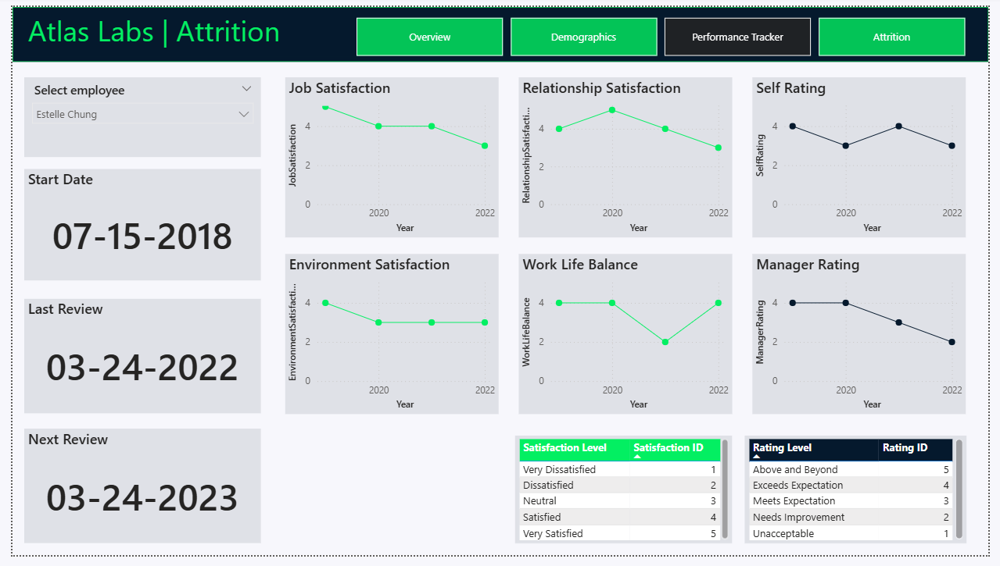

# 📊 HR Analytics Dashboard (Power BI)

An end-to-end HR Analytics dashboard built using Power BI to analyze employee demographics, performance, and attrition.
This project demonstrates data modeling, DAX, and business-driven insights to support HR decision-making.

---

## 📌 Project Overview

Organizations often struggle to understand employee behavior, retention patterns, and workforce composition.
This dashboard provides a comprehensive analysis of HR data to uncover key trends and actionable insights.

The report is designed to answer critical business questions such as:

* What is the overall workforce composition?
* How are employees performing?
* What factors are contributing to employee attrition?

---

## 🎯 Objectives

* Analyze workforce demographics and diversity
* Monitor employee performance and satisfaction
* Identify key drivers of employee attrition
* Provide actionable recommendations for HR strategy

---

## 🧩 Data Model

The data model follows a **star schema**, ensuring efficient querying and scalability.

### 🔹 Fact Table

* **Performance Rating**
  Contains measurable metrics such as job satisfaction, work-life balance, and performance ratings.

### 🔹 Dimension Tables

* **Employee** → demographic and job-related attributes
* **Rating Level** → performance categories
* **Satisfaction Level** → satisfaction labels
* **Education Level** → education classification
* **Date** → time-based analysis

This structure enables fast filtering, accurate relationships, and efficient analysis.

---

## 📊 Dashboard Structure

### 🔹 1. Overview

Provides a high-level summary of workforce metrics:

* Total Employees
* Active vs Inactive Employees
* Attrition Rate

---

### 🔹 2. Demographics

Analyzes workforce composition:

* Age distribution
* Gender distribution
* Marital status
* Salary by ethnicity

---

### 🔹 3. Performance Tracker

Tracks employee engagement and performance:

* Job Satisfaction trends
* Work-Life Balance
* Manager Ratings
* Training opportunities

---

### 🔹 4. Attrition Analysis

Identifies key drivers of employee turnover:

* Attrition by Department and Job Role
* Attrition by Overtime
* Attrition by Travel Frequency
* Attrition by Tenure

---

## 🔍 Key Insights

### 👥 Workforce Insights

* The workforce is heavily concentrated in the **20–29 age group**, indicating a young employee base
* Slightly higher representation of **female employees** compared to male

---

### 📊 Performance Insights

* Employees show **moderate satisfaction levels**, with noticeable variation across different metrics
* Work-life balance fluctuates, suggesting potential workload or management challenges

---

### ⚠️ Attrition Insights

* **Overtime is a major driver of attrition**, with significantly higher exit rates among employees working overtime
* Employees with **lower tenure (0–2 years)** show the highest attrition, indicating onboarding or early engagement issues
* Attrition varies across departments, highlighting role-specific challenges
* Frequent business travel is associated with increased attrition

---

### 🌍 Diversity & Salary Insights

* Salary distribution differs across **ethnic groups**, indicating potential disparities
* Certain groups have comparatively lower average salaries, which may impact retention

---

## 💡 Business Recommendations

Based on the analysis, the following actions are recommended:

### 🔹 Improve Work-Life Balance

* Reduce excessive overtime
* Introduce flexible work policies
* Monitor workload distribution

---

### 🔹 Strengthen Employee Retention (Early Stage)

* Enhance onboarding programs
* Provide mentorship for new employees
* Conduct early feedback surveys

---

### 🔹 Address Attrition Drivers

* Identify high-risk departments and roles
* Implement targeted retention strategies
* Improve job satisfaction through engagement initiatives

---

### 🔹 Enhance Diversity & Pay Equity

* Review salary structures across demographic groups
* Ensure fair and equitable compensation
* Promote inclusive workplace policies

---

### 🔹 Improve Performance Management

* Regularly track employee satisfaction metrics
* Align manager feedback with employee development
* Increase access to training opportunities

---

## 🛠️ Tools & Technologies

* **Power BI** → Data visualization and dashboard creation
* **Power Query** → Data cleaning and transformation
* **DAX (Data Analysis Expressions)** → Measures and calculations

---

## 📷 Dashboard Preview

### 🔹 Overview

### 🔹 Demographics

### 🔹 Performance Tracker

### 🔹 Attrition Analysis

---

## 📌 Conclusion

This project demonstrates how data can be used to uncover meaningful HR insights and support strategic decision-making.
The dashboard enables organizations to proactively address attrition, improve employee satisfaction, and optimize workforce planning.

---

